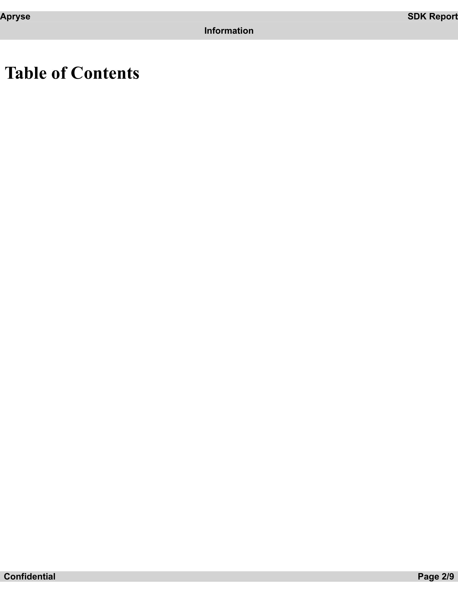
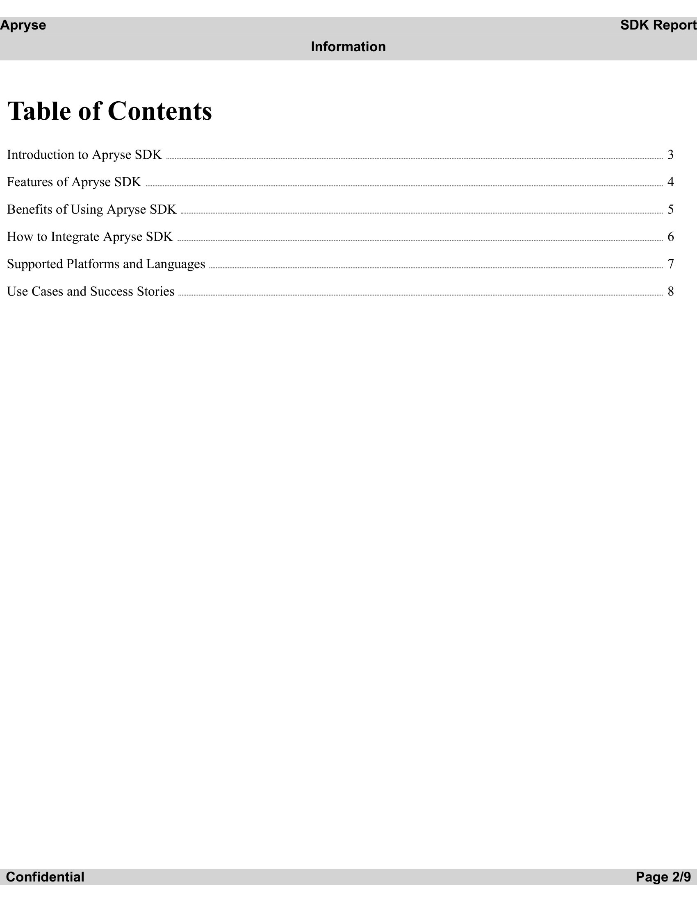

# Apryse SDK Samples

This repository contains more advanced samples using the @pdftron/pdfnet-node SDK.

# Summary
- [Conversions](#conversions)
  - [HTML to PDF](#html-to-pdf)

## Setup

Make sure to insert your license key into the license-key.json file before running any samples.

## **Conversions**

The Apryse SDK offers a comprehensive set of conversions capabilities. 

 - ### **HTML to PDF**
   Apryse SDK offers the ability to convert HTML to PDF with high fidelity and accuracy using our HTML2PDF module. The sample covers the following:

   -  Header and Footer templating as listed on the [chromium docs](https://chromedevtools.github.io/devtools-protocol/tot/Page/#method-printToPDF)
   - Replacing placeholders with updated page numbers to generate a dynamic Table of Contents
    
    <br />

    ### **Sample output of the script**

    Blank Table of Contents    |  Updated Table of Contents
    :-------------------------:|:-------------------------:
      |  

   <br />To run this sample use the following command
   ```bash
   node .\src\samples\conversions\html-to-pdf\index.js
   ```
   
   The output file can be located at **.\src\files\output\html-to-pdf.pdf**

